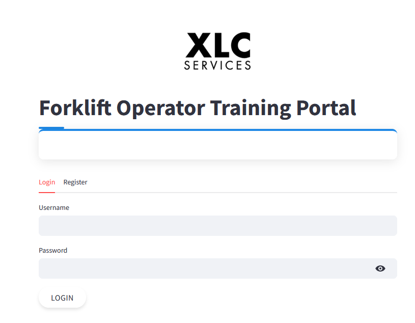

## Updated README.md

```markdown
# Forklift Operator Training Application

A comprehensive web application for training and assessing forklift operators on safety protocols and operational procedures, with certification management and advanced analytics.



## Features

- **Interactive Quiz System**
  - Configurable quizzes with category filtering
  - Time limits and progress tracking
  - Immediate feedback and explanations
  - Question randomization

- **Dashboard & Analytics**
  - Personalized user dashboard
  - Performance metrics and progress visualization
  - Category-based performance analysis
  - Certification status tracking

- **Certification Management**
  - Automatic certificate generation for passing scores
  - Customizable certificate templates
  - Expiration tracking and renewal reminders
  - Unique verification IDs

- **Admin Controls**
  - Comprehensive analytics dashboard
  - Question management with import/export
  - User management and access control
  - System configuration and branding
  - Score data management

- **Modern UI/UX**
  - Responsive design for all devices
  - Intuitive navigation
  - Visual feedback and progress indicators
  - Company branding integration

## Project Overview

The Forklift Operator Training Application helps manufacturing facilities train and certify their forklift operators in compliance with OSHA regulations. The system provides:

- **Safety Compliance**: Test knowledge of OSHA regulations and best practices
- **Performance Tracking**: Monitor operator progress and identify knowledge gaps
- **Certification Management**: Automatically generate and track training certificates
- **Administration Tools**: Manage questions, users, and system settings
- **Data Analysis**: Gain insights from training performance data

## Installation

```bash
# Clone the repository
git clone https://github.com/yourusername/forklift-training-app.git
cd forklift-training-app

# Create and activate virtual environment
python -m venv venv
source venv/bin/activate  # On Windows: venv\Scripts\activate

# Install dependencies
pip install -r requirements.txt

# Run the application
streamlit run app.py
```

## Project Structure

```
forklift_app/
│
├── app.py                 # Main application file
├── requirements.txt       # Dependencies
│
├── assets/                # Static files
│   └── logo.png           # Company logo (when uploaded)
│
├── data/                  # Data storage
│   ├── users.json         # User credentials and information
│   ├── questions.json     # Quiz questions, options, and answers
│   ├── scores.json        # Quiz attempt history and scores
│   ├── settings.json      # Application configuration
│   └── backups/           # Automatic backups of data files
│
└── modules/               # Application modules
    ├── __init__.py
    ├── auth.py            # Authentication functions
    ├── data_manager.py    # Data loading/saving functions
    ├── ui.py              # UI components and styling
    ├── certificate.py     # Certificate generation
    ├── pages/             # Page modules
    │   ├── __init__.py
    │   ├── login.py       # Login page
    │   ├── dashboard.py   # Dashboard page
    │   ├── quiz.py        # Quiz page
    │   ├── scores.py      # Scores page
    │   ├── documentation.py # Documentation page
    │   └── admin.py       # Admin panel
    └── utils.py           # Utility functions
```

## User Roles

- **Operators**: Take quizzes, view scores, download certificates, track progress
- **Administrators**: Manage questions, view analytics, manage users, configure system settings

## Default Admin Login

- Username: `admin`
- Password: `admin123`

**Important**: Change the default admin password after first login.

## Customization

The application supports several customization options:

- **Company Branding**: Upload your company logo
- **Certificate Design**: Customize certificate appearance
- **Quiz Settings**: Configure passing score, time limits, question counts
- **System Behavior**: Set certificate validity, registration options, security policies

## Deployment

This application is configured for easy deployment:

1. **Local Deployment**:
   - Follow the installation instructions above
   - Suitable for single-location training

2. **Server Deployment**:
   - Deploy on an internal server for company-wide access
   - Ensure proper file permissions for data directory

3. **Streamlit Cloud**:
   - Push the project to a GitHub repository
   - Connect the repository to Streamlit Cloud
   - Specify `app.py` as the main file

## Development

To contribute to this project:

1. Fork the repository
2. Create a feature branch (`git checkout -b feature/amazing-feature`)
3. Commit your changes (`git commit -m 'Add some amazing feature'`)
4. Push to the branch (`git push origin feature/amazing-feature`)
5. Open a Pull Request

## License

This project is licensed under the MIT License.

## Acknowledgments

- Streamlit for the web framework
- OSHA for forklift safety guidelines and standards
```

These updated files reflect all the enhancements we've made to your application, including:

1. The new dashboard feature
2. Enhanced quiz functionality
3. Improved admin panel with analytics
4. Better documentation covering all features
5. Updated project structure
6. Modernized UI/UX

Feel free to make any additional adjustments to better reflect your specific implementation or to add any other details you'd like to include.
